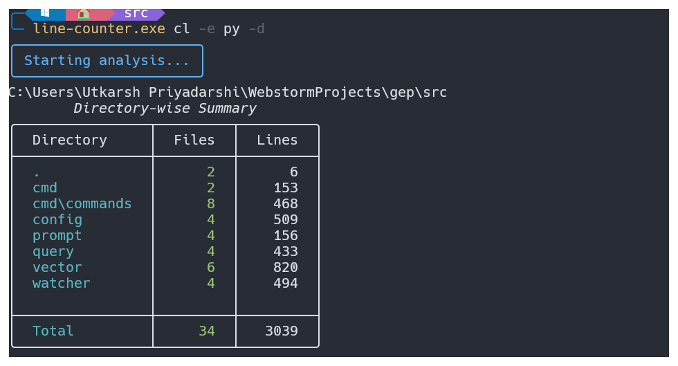
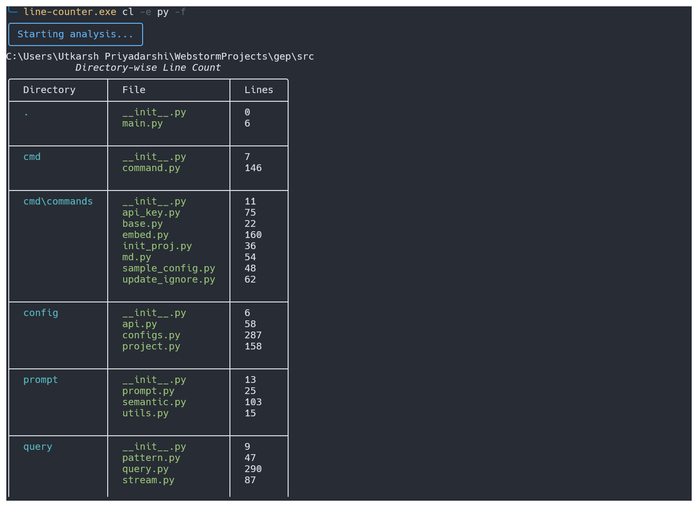

# 📊 Line Counter CLI

A powerful command-line interface tool for counting lines of code in your projects. This tool provides detailed analysis of your codebase with support for multiple file extensions, ignore patterns, and various viewing options.

## Features

- 📁 Count total lines across your project
- 🔍 Filter by specific file extensions
- 🚫 Ignore specific patterns or directories
- 📊 View results per file or per directory
- 📈 Progress tracking during analysis
- 🎨 Beautiful terminal output using Rich

## Installation

```bash
# Installation instructions (adjust based on your distribution method)
pip install line-counter-cli
```

## Usage

The basic command is `cl` (count lines) with various options:

```bash
# Basic usage (counts all files in current directory)
cl

# Count specific file extensions
cl -e py -e js

# Count lines in a specific directory
cl -d /path/to/directory

# Ignore specific patterns
cl -i '**/venv/**' -i '**/.git/**'

# Show file-wise breakdown
cl -f

# Show directory-wise breakdown
cl -d
```

## Options

| Option               | Short  | Description                                            |
| -------------------- | ------ | ------------------------------------------------------ |
| `--root-dir`       | `-d` | Root directory to analyze (default: current directory) |
| `--extensions`     | `-e` | File extensions to count (can be used multiple times)  |
| `--ignore`         | `-i` | Patterns to ignore (can be used multiple times)        |
| `--file-wise`      | `-f` | Show line count breakdown per file                     |
| `--directory-wise` | `-d` | Show line count breakdown per directory                |

## Examples

```bash
# Count Python and JavaScript files, excluding venv directory
cl -e py -e js -i '**/venv/**'

# Show detailed directory-wise breakdown for a specific path
cl -d /path/to/project --directory-wise

# Count all files with per-file breakdown
cl --file-wise
```

## Output Examples

### Directory-Wise analysis



### File-Wise analysis
